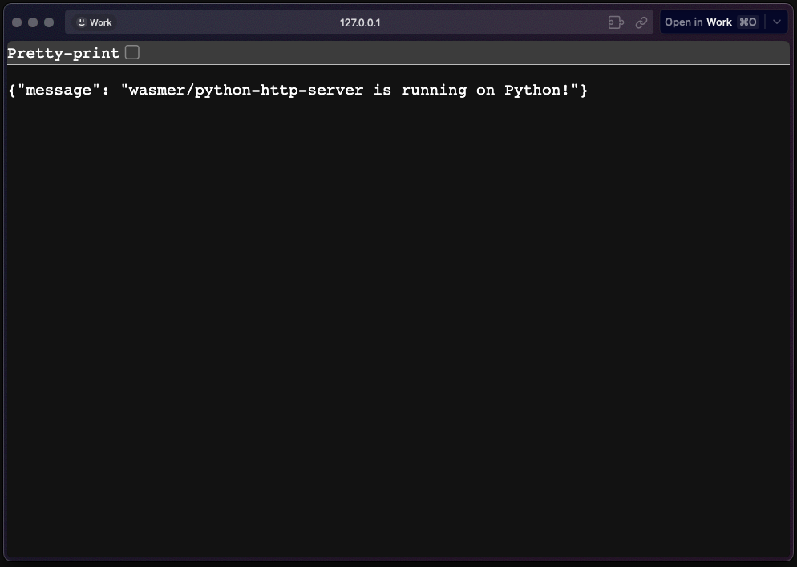

# Sample Python HTTP Server with Wasmer

This is a sample repo for running a python based HTTP server on Wasmer Edge.

Follow the quickstart guide on [Wasmer Docs](https://docs.wasmer.io/edge/quickstart/python)

## Running it locally

1. Clone the repo
2. Run it locally using the command below:

```shell
wasmer run . --net --env PORT=4333
```

## Running it using wasmer registry

This package is published to wasmer registry as [`wasmer/python-http-server`](https://wasmer.io/wasmer/python-http-server)

You can try this locally.

```shell
wasmer run wasmer/python-http-server --net --env PORT=4333
```

This would start an http server on `http://127.0.0.1:4333`

<!-- Add an image -->



## Live on Wasmer Edge

```text
  App Info
> App Name: wasmer-python-http-server-worker
> App URL: https://wasmer-python-http-server-worker.wasmer.app
```
